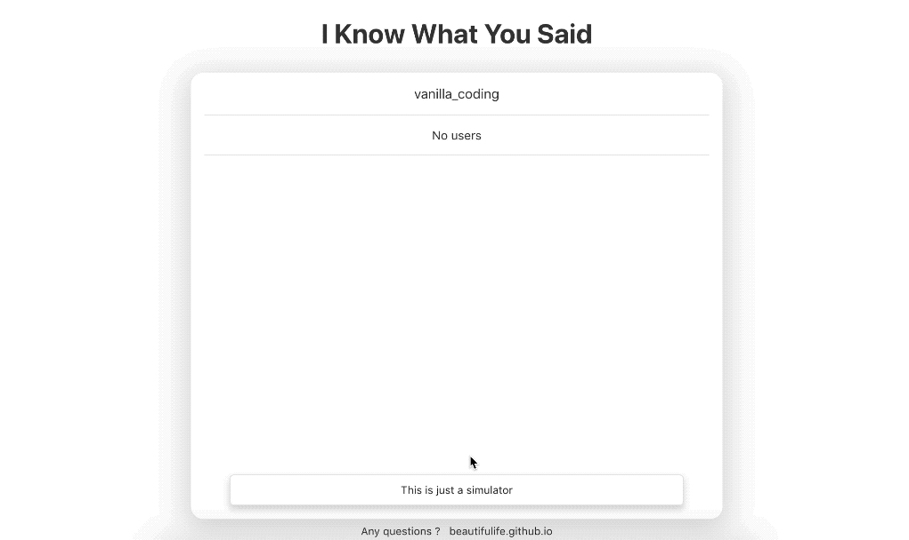

# Vanilla-Chat-Simulator

React & Redux를 이용하여 채팅 기록을 재생할 수 있도록 하는 과제




## Setup

Install dependencies

```sh
$ yarn install (or npm install)
```

## Development

```sh
$ yarn start (or npm start)
# visit http://localhost:3000
```

## Features

- 채팅 기록을 `https://chat-simulator.firebaseio.com/chats.json`로부터 불러와 재생
- 각 데이터 구조
  - `delta`: 시간을 의미. 예) 1000 - 채팅 시작후 1초 경과를 의미
  - `payload`: 해당 시간에 발생한 사건에 대한 세부 정보
- 사용자의 `display_name`과 메시지 `text` 출력
- 현재 접속자 목록 출력
